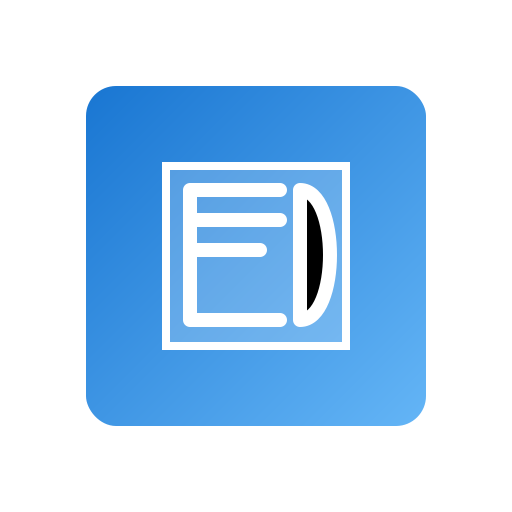

# EduDive - Interactive 3D Learning Platform

EduDive is an educational web application that provides interactive 3D models for engineering disciplines including mechanical, civil, and electrical engineering. The platform enables students to explore complex engineering concepts through manipulable 3D visualizations.



## Features

- Interactive 3D model viewing with zoom, rotate, and pan capabilities
- Models organized by engineering disciplines
- Dark/light mode theme toggle
- Responsive design for desktop and mobile devices
- Course progress tracking
- Wireframe viewing mode

## Technology Stack

- React 18 with TypeScript
- Vite for fast builds and development
- Material UI components
- Three.js for 3D rendering
- React Router for navigation

## Development

### Prerequisites

- Node.js 18+
- npm or yarn

### Installation

```bash
# Clone the repository
git clone <repository-url>
cd edudive

# Install dependencies
npm install

# Start development server
npm run dev
```

### Building for Production

```bash
# Build the application
npm run build
```

This creates a `dist` folder containing the compiled application. **Note: You do not need to delete the dist folder before each build** - the build process will automatically clean and recreate it.

## Deployment

The application is configured for automatic deployment with Netlify:

1. The `netlify.toml` file contains the build settings and redirect rules
2. The `public/_redirects` file ensures proper SPA routing
3. When pushing to the connected GitHub repository, Netlify automatically:
   - Runs the build process
   - Deploys the content of the `dist` directory
   - Applies the configuration from netlify.toml

## Project Structure

```
edudive/
├── public/             # Static assets
│   └── icons/          # App icons 
├── src/
│   ├── components/     # React components
│   ├── hooks/          # Custom React hooks
│   ├── models/         # Data models
│   ├── styles/         # CSS and styling
│   ├── theme/          # MUI theme configuration
│   ├── App.tsx         # Main app component
│   └── main.tsx        # Entry point
└── dist/               # Built files (created during build)
```

## License

MIT
